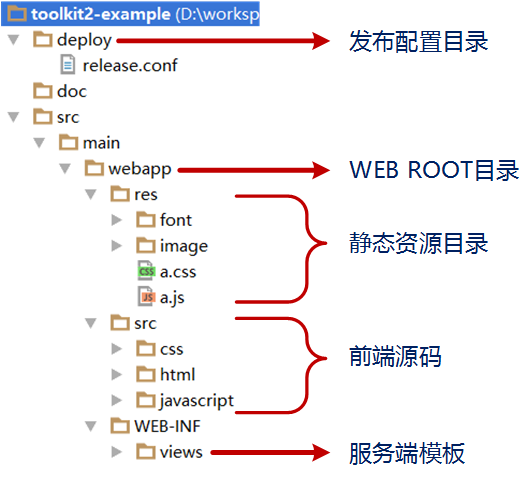
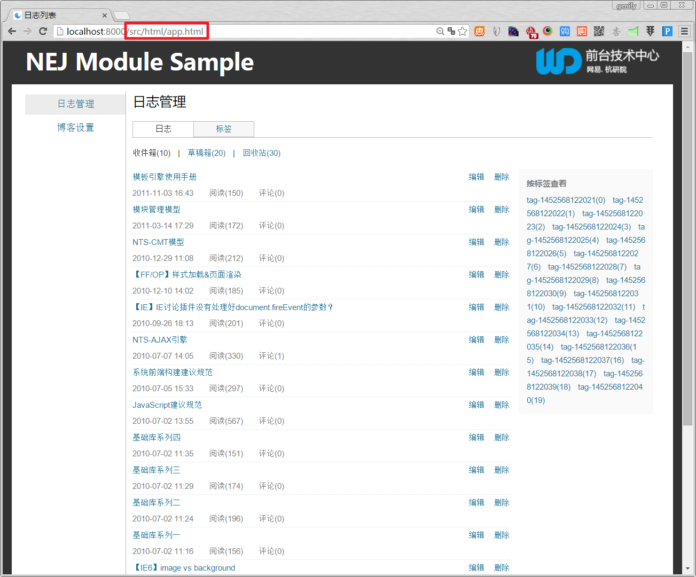
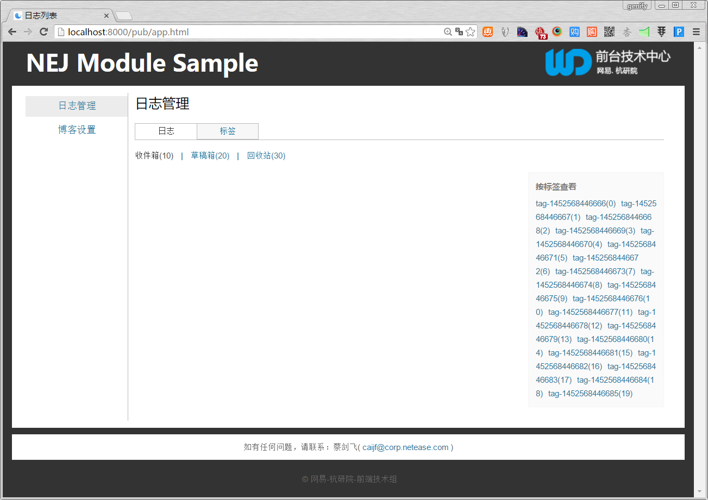

# 发布工具案例说明

这是一个使用[打包工具](https://github.com/genify/toolkit2)打包前端代码的WEB工程案例，项目仅包含前端相关的代码，其中各目录的说明如下所示



## 准备工作

1. 安装[nodejs](http://nodejs.org/)环境（>=0.12.x）
2. 安装[打包工具](https://github.com/genify/toolkit2)

	```bash
	npm install nej –g
	```
3. 如果跑本案例需要起本地WEB服务可安装[puer](https://github.com/leeluolee/puer)

	```bash
	npm install puer -g
	```

## 查看案例

在webapp目录下运行本地WEB服务器后，通过浏览器访问以下路径查看案例



## 执行打包

通过执行以下命令对本案例的工作前端做打包，可以通过配置deploy/release.conf中的不同参数输出不同的结果

```bash
nej build /path/to/release.conf
```

## 查看发布结果

按照默认的配置页面会输出到webapp/pub/下，通过浏览器访问以下路径查看打包后的结果

